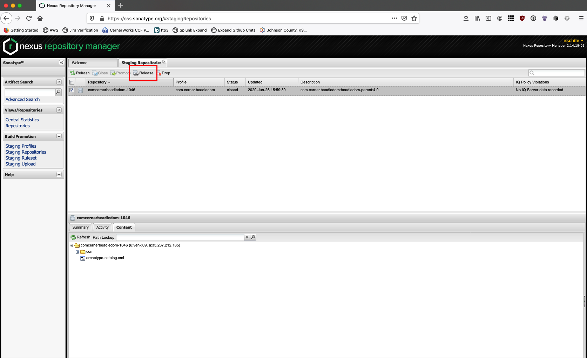

# Releasing Beadledom

## Release approval process

* Update the change log by replacing the text `in development` against the current version in the changelog to the release date.
* Create a pull request for the above change with the title `Release Review {release_version}`.
* Approving the release review pull request implies that the core maintainers of Beadledom has approved the release of Beadledom for the current version. *Requires approval from atleast two core maintainers*.
* Once the release review is merged, release manager starts the release.

Note: Releasing the project requires an initial set up. The [Preparing for the Release](preparing-for-the-release) section is needed only for the initial setup. If the setup is already made once, skip to [Release process](release-process)

## Preparing for the Release

### Sonatype setup

* A valid Sonatype user account is required to release this project. To create an account sign up with [Sonatype](https://issues.sonatype.org/secure/Signup!default.jspa).
* Once you have the Sonatype user account, you need to comment on this [JIRA](https://issues.sonatype.org/browse/OSSRH-27635) to get yourself added to the Beadledom project group.

### One Time Shared Travis setup
* These steps need to be performed only if we were to revoke secrets that is in use by travis and create a new one. Also, since this is a shared setup, only one of the maintainers need to do it once. 
* Execute the following commands in your terminal to prepare travis-ci

    ```
    $ cd /path/to/beadledom
    $ gem install travis
    $ travis login --com
    #  Prompts you to enter github username, password and two-factor authentication if enabled.
    $ travis enable -r <username>/<repository> --com
    <username>/<repository>: enabled :)
	```
* Install `gpg2` - we will be using this tool to automatically sign off our artifacts
	* install it via brew - `brew install gpg2`. There are other ways to install this tool but doing it via brew can help us all to be in sync with the version of the tool we are using.
	* Follow this [guide](http://central.sonatype.org/pages/working-with-pgp-signatures.html#generating-a-key-pair) to generate your own gpg key and secret.
	  * For simplicity sake, use your email address for both username and email.
	* Follow this [guide](https://central.sonatype.org/pages/working-with-pgp-signatures.html#distributing-your-public-key) to distribute your public key created as part of the previous step.
	* Export the generated keys onto a file named `signingkey.asc`
	```bash
	$ gpg --export --armor <email_address> > signingkey.asc
  $ gpg --export-secret-keys --armor <email_address> >> signingkey.asc
	```
* Encrypt the `signingkey.asc` file using the travis command. Read [travis docs](https://docs.travis-ci.com/user/encrypting-files/) for more details. 
  ```bash
  $ travis encrypt-file signingkey.asc --com
  ``` 
* This will generate a decrypt command which needs to be added to the [`publish.sh`](.travis/publish.sh) script as a decrypting step.
* All the secrets and passwords must be encrypted and passed on to travis as [secured environment variables](https://docs.travis-ci.com/user/environment-variables/#Defining-encrypted-variables-in-.travis.yml).
	```  
    $ travis encrypt --add -r cerner/beadledom SONATYPE_USERNAME=<sonatype username>
    $ travis encrypt --add -r cerner/beadledom SONATYPE_PASSWORD=<sonatype password>
    $ travis encrypt --add -r cerner/beadledom ENCRYPTION_PASSWORD=<password to encrypt>
    $ travis encrypt --add -r cerner/beadledom GPG_KEYNAME=<gpg keyname (ex. 1C06698F)>
    $ travis encrypt --add -r cerner/beadledom GPG_PASSPHRASE=<gpg passphrase>
    ```
* Create a new set of ssh keys to push the documentation site to `gh-pages` branch. Follow this github [documentation](https://help.github.com/articles/generating-a-new-ssh-key-and-adding-it-to-the-ssh-agent/#generating-a-new-ssh-key) to create the ssh keys.
	* **Note**: The ssh keys file names has to be `deploy_site_key`.
	* Before generating the keys make sure the current directory is the directory where all your ssh keys are stored. By default this would be `~/.ssh`
* Add the contents of `deploy_site_key.pub` to the [beadledom deploy keys](https://github.com/cerner/beadledom/settings/keys).
	* *pro tip*: You can copy the contents using `pbcopy < path/to/deploy_site_key.pub`
* Encrypt the `deploy_site_key` key file by executing the below commands.

	```
	$ cd path/to/beadledom
	$ travis encrypt-file ~/.ssh/deploy_site_key --com
	```
* This will generate a decrypt command which needs to be added to the [`publish.sh`](.travis/publish.sh) script as a decrypting step.
* Commit all the changes to the beadledom repo.

## Release process

After preparing the machine for the release follow the below steps

* Clean up the previous release backup/release property files.

    ```
    ./mvnw release:clean
    ```
* Prepare the project for releasing.

    ```
    ./mvnw clean release:prepare
    ```
    * The above command will prompt for the following
        * current release version (should be same as in changelog)
        * next development cycle version. After that it also prompts for the next development version
    * Maven builds the project to make sure everything is good. If the build succeeds then it updates the versions of the project and pushes the following to beadledom git repo
        * a commit for the release
        * a commit for the next development cycle
        * the tag that was cut for the release
    * **Note**: 
        * Currently accounts that have the ability to perform releases must have [two factor authentication](https://help.github.com/articles/about-two-factor-authentication/) enabled. Because of this we need to generate a [personal access token](https://help.github.com/articles/creating-a-personal-access-token-for-the-command-line/) to use in lieu of a password during a release.
        * If at anytime the release need to be stopped. Cancel the maven commands using (ctrl + z) and run the below command 
        
        ```
        ./mvnw release:rollback
        ```

* Travis starts a new build for released tag and pushes the artifact to [sonatype staging repo](https://oss.sonatype.org/#stagingpositories).
* Once the artifacts are pushed to the Sonatype staging repo
    * Scroll down to the latest beadledom repo from the list.
    * click on the release button to push the artifact to maven central.
    
    * **Note**: It roughly takes about 2 hours for the artifacts to sync with the maven central.
* Builds the documentation site for the released tag and publishes it to `gh-pages`.
* Travis starts another build for the current snapshot and pushes the artifacts to [sonatype snapshots repo](https://oss.sonatype.org/content/repositories/snapshots/com/cerner/beadledom/).

To monitor the build go to [beadledom travis-ci builds](https://travis-ci.com/github/cerner/beadledom/builds).
